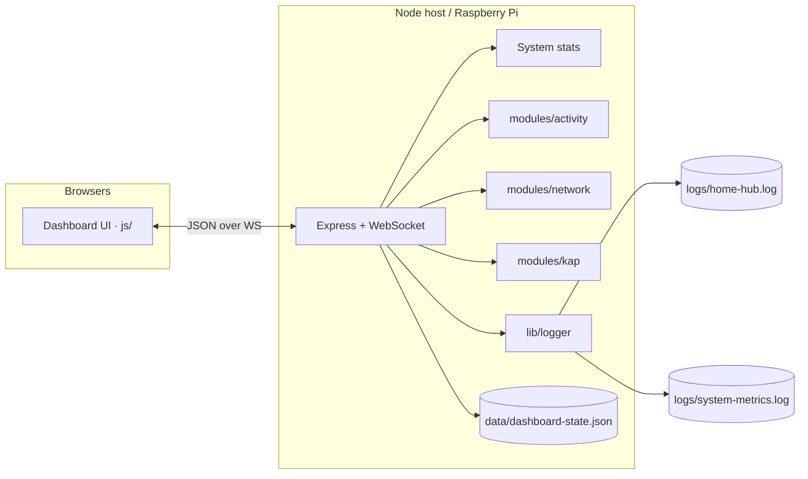

<div align="center">

# Home Hub

**Smart home dashboard for Raspberry Pi**

Sidebar modules for tools · Home for widgets · Live sync over WebSocket

[](https://nodejs.org/)
[](https://expressjs.com/)
[](https://github.com/websockets/ws)
[](./package.json)

</div>

---

## Overview

Home Hub is a modular dashboard for a Raspberry Pi (or any Node host). Use the **sidebar** for full tools and **Home** for glanceable widgets — Apple Watch–style complications with Fitness rings for System Monitor.

```text
┌─────────────┬──────────────────────────────────────┐
│  Home Hub   │  page title · clock · theme · sync   │
├─────────────┼──────────────────────────────────────┤
│  Home       │                                      │
│  Logs       │   widgets  /  module page content    │
│  KAP        │                                      │
│  Monitor    │                                      │
│  Network    │                                      │
│             │                                      │
│  + Add      │                                      │
│    Widget   │                                      │
└─────────────┴──────────────────────────────────────┘
```

| Area | Role |
|:-----|:-----|
| **Sidebar** | App modules (pages): Home · Logs · KAP · Monitor · Network |
| **Home** | Widget grid: System Monitor, Speed Test, KAP |
| **Developer** | Update (watch mode) · Clear All widgets |

New server features go in `modules/<name>/` (`server.js` + `client.js`). Core UI lives under `js/`.

KAP / Ollama integration: see [`CONTRACT.md`](./CONTRACT.md) (aligned with [pi-llm](https://github.com/yigitcnsn/pi-llm)).

---

## Features

- **Home widgets** — Apple Watch–style complications (circular small / modular medium & large); add, edit, resize, drag to reorder (type + size only — no custom names)
- **System Monitor** — pinned Fitness rings (CPU · Mem · Disk) with temperature at the center; live stats every 5s
- **Activity Monitor** — sidebar page with large history charts + metrics table (deep view; Home keeps the compact rings)
- **Logs** — live server + client log stream with All / Info / Warn / Error filters and Clear info
- **Network Analyzer** — full diagnostics on the Network page
- **Speed Test widget** — download / upload + Run on Home only
- **KAP** — Borsa İstanbul disclosures: watchlist, scrape, Ollama sentiment classify (sidebar + optional Home widget)
- **Light & dark theme**, fullscreen, multi-device sync over WebSocket
- **Persistent layout** — browser `localStorage` + server `data/dashboard-state.json` (survives Update / `--watch` restarts)
- **In-page dialogs** — no browser `alert`/`confirm`; widget create failures show which widget broke and offer Clear widgets
- **Client → server logging** — UI errors land in Logs / `logs/home-hub.log`
- **File logging** — `logs/home-hub.log` (events) + `logs/system-metrics.log` (CPU / temp / mem / disk / load every 5s)

### Network Analyzer

| Capability | Details |
|:-----------|:--------|
| Interfaces | IP, MAC, gateway, DNS |
| Latency | Gateway, `1.1.1.1`, `8.8.8.8` |
| DNS timing | Resolve time for a known host |
| Speed | Download + upload (Cloudflare) |
| Wi‑Fi | SSID / signal when available |
| LAN | Neighbors + active TCP connections |
| History | Trends + recent test log |

Snapshot refreshes about every **20s**. Full test runs **hourly**, or on demand with **Run full test**.

> Home **Speed Test** widget = download / upload + **Run** only  
> (`Add Widget` → Speed Test)

### KAP module

On the Pi:

```bash
cp .env.example .env   # set KAP_WATCHLIST, Ollama, etc.
export OLLAMA_BASE_URL=http://127.0.0.1:11434
export OLLAMA_MODEL=qwen2.5:3b
export KAP_WATCHLIST=THYAO,ASELS
export KAP_LANGUAGE=tr
cd ~/home-hub && npm start
```

Sidebar **KAP**: watchlist badges, latest disclosures, scrape (watchlist / general), paste→classify, sentiment badges. Data under `data/kap/`. Optional Home widget shows the watchlist at a glance.

---

## Quick start

```bash
git clone https://github.com/yigitcnsn/home-hub.git
cd home-hub
npm install
./start.sh
```

Or with auto-update on the Pi (no local edits on the device):

```bash
cp .env.example .env   # edit KAP_WATCHLIST, etc.
./start.sh --watch        # foreground supervisor
# or
./start.sh --watch --bg   # background (logs/watch.out)
```

Every ~60s (`HOMEHUB_WATCH_SECONDS`) it `git fetch`es; if `origin` is ahead it `git pull --ff-only`, restarts Node, and open browsers reload when `/api/version` changes.

Sidebar **Developer → Update** requests an immediate check (does not wait for the timer). Requires `--watch`.

Open **[http://localhost:3000](http://localhost:3000)**  
On your LAN: `http://<host-ip>:3000` or `http://ev.local`

### Raspberry Pi deploy

```bash
# on your machine
git push

# on the Pi
git pull
npm start   # or ./start.sh --watch
```

Then hard-refresh the browser (or let auto-reload do it under `--watch`).

> Static UI updates on refresh. **Server / module changes need a Node restart** (or `--watch`).

---

## Architecture



| Layer | Responsibility |
|:------|:---------------|
| **`js/`** | Client mixins: widgets, sync, dialogs, storage, logging |
| **`modules/`** | Pluggable page + widget features (server + client) |
| **`server.js`** | Express, WebSocket `/dashboard`, system stats, layout persistence |
| **`lib/`** | Logger + build id (`git` short SHA → `/api/version`) |

---

## Widget types

| Type | Notes |
|:-----|:------|
| **System Monitor** | Persistent — Fitness rings; always on Home |
| **Speed Test** | Compact down / up + Run |
| **KAP** | Watchlist chips (optional) |

**Sizes:** Small `1×1` (circular) · Medium `2×1` · Large `2×2`  
System Monitor always spans the full row.

---

## Project layout

```text
home-hub/
├── index.html                 # Shell, panels, Add Widget + app dialogs
├── styles.css                 # Theme + complication styles
├── script.js                  # Boots ModuleManager only
├── server.js                  # Express + WebSocket + system stats
├── start.sh                   # Launch / --bg / --watch supervisor
├── .env.example               # KAP + Ollama + watch interval
├── CONTRACT.md                # KAP ↔ Ollama / pi-llm
├── js/                        # Client core (mixins)
│   ├── module-manager.js      # CRUD, nav, DnD, theme, clock
│   ├── widgets.js             # Complication render + Fitness rings
│   ├── system-monitor.js      # Live stats → Home widget
│   ├── storage.js             # localStorage + Clear All
│   ├── sync.js                # WebSocket sync + auto-reload
│   ├── dialog.js              # In-page dialogs / failsafe
│   ├── logging.js             # Client → server logs
│   └── utils.js
├── lib/
│   ├── logger.js              # File + memory logging
│   └── build-id.js
├── modules/
│   ├── index.js               # Server module registry
│   ├── activity/              # Logs page
│   ├── system/                # Activity Monitor page (client)
│   ├── network/               # Analyzer page + Speed Test widget
│   └── kap/                   # KAP scrape / classify / store
├── data/                      # Runtime (gitignored): dashboard-state, kap/, flags
└── logs/                      # Runtime (gitignored): home-hub.log, system-metrics.log
```

---

## Environment

Copy `.env.example` → `.env` (loaded by `./start.sh`):

| Variable | Purpose |
|:---------|:--------|
| `OLLAMA_BASE_URL` | Ollama API (default `http://127.0.0.1:11434`) |
| `OLLAMA_MODEL` | Model name (default `qwen2.5:3b`) |
| `KAP_LANGUAGE` | Classify language (default `tr`) |
| `KAP_WATCHLIST` | Comma-separated tickers (e.g. `THYAO,ASELS`) |
| `KAP_PROMPT_PATH` | Sentiment prompt file |
| `KAP_POLL_INTERVAL_MS` | Optional scrape poll interval |
| `HOMEHUB_WATCH_SECONDS` | Watch-mode fetch interval (default `60`) |
| `PORT` | HTTP port (default `3000`) |

---

## API & WebSocket

<details>
<summary><strong>HTTP</strong></summary>

| Method | Path | Description |
|:-------|:-----|:------------|
| `GET` | `/api/version` | Build id, branch, startedAt |
| `POST` | `/api/update/now` | Request watch-mode pull now |
| `GET` | `/api/logs` | Recent log entries |
| `POST` | `/api/logs/client` | Ingest client log |
| `POST` | `/api/logs/clear-info` | Remove info-level logs |
| `GET` | `/api/network` | Analyzer state + snapshot |
| `GET` | `/api/kap` | KAP state |
| `GET` | `/api/kap/disclosures` | Watchlist + disclosures |
| `GET` | `/api/kap/jobs/:id` | Classify / scrape job status |
| `POST` | `/api/kap/scrape` | `{ mode: 'watchlist' \| 'general' }` |
| `POST` | `/api/kap/classify` | Paste text or `disclosureId` |

</details>

<details>
<summary><strong>WebSocket</strong> — <code>ws://&lt;host&gt;:3000/dashboard</code></summary>

**Server → client**

| Type | Purpose |
|:-----|:--------|
| `build_info` | Build id (triggers browser reload) |
| `system_stats` | Pi metrics → System / Activity Monitor |
| `full_state` / `instance_update` | Widget layout & instance sync |
| `logs_snapshot` / `log_entry` | Log stream |
| `network_state` / `network_stats` / `network_snapshot` | Analyzer updates |
| `kap_state` | KAP updates |
| `ping` | Keep-alive |

**Client → server**

| Type | Purpose |
|:-----|:--------|
| `full_state_sync` / `instance_update` | Push layout / instance data |
| `client_log` | UI errors → Logs |
| `clear_info_logs` | Clear info logs |
| `pong` | Ping reply |
| `run_network_test` | Full network analysis |
| `refresh_network_snapshot` | Refresh interfaces / LAN / Wi‑Fi |
| `kap_scrape` / `kap_classify` | KAP jobs |

</details>

---

## Adding a module

1. Create `modules/<name>/server.js` exporting `{ id, register(ctx) }`
2. Register it in `modules/index.js`
3. Add `modules/<name>/client.js` and set `window.HomeHubModules.<name>`
4. **Sidebar page:** `nav: true`, `view: '<id>'`, plus a panel in `index.html` with `data-view-panel="<id>"`
5. **Home widget:** `render`, `getSampleData`, and an option in the Add Widget dropdown
6. Keep core UI changes in `js/` (mixins on `ModuleManager.prototype`)

---

## Troubleshooting

| Issue | Fix |
|:------|:----|
| Port `3000` in use | Stop the old process, then `npm start` / `./start.sh` |
| Sync disconnected | Confirm the server is running; check firewall |
| Widgets empty after Update | Open Home once to re-seed; layout is in `data/dashboard-state.json` + browser storage |
| Widget create error dialog | Check **Logs** for the failing widget; use **Clear widgets** if the layout is corrupt |
| Network page stale | `git pull`, restart Node, hard-refresh |
| Speed Test stuck on *Testing…* | Restart server after pull so finish broadcasts are current |
| KAP classify fails | Confirm Ollama is up and `OLLAMA_*` / `KAP_*` env vars match [`CONTRACT.md`](./CONTRACT.md) |

---

## Requirements

- **Node.js** 18+
- Modern browser with CSS Grid, Flexbox, WebSocket, and `localStorage`
- Optional: **Ollama** on the Pi for KAP sentiment

---

<div align="center">

MIT · Built for the home lab

</div>
