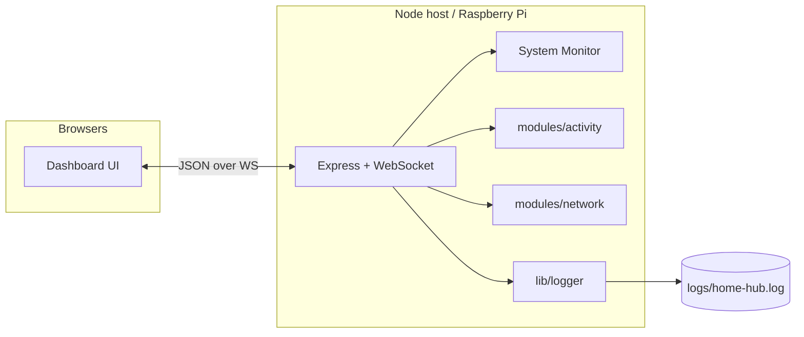

<div align="center">

# Home Hub

**Smart home dashboard for Raspberry Pi**

Sidebar modules for tools · Home for widgets · Live sync over WebSocket

[](https://nodejs.org/)
[](https://expressjs.com/)
[](https://github.com/websockets/ws)
[](./package.json)

</div>

---

## Overview

Home Hub is a modular dashboard you run on a Raspberry Pi (or any Node host). Use the **sidebar** for full tools (Logs, Network Analyzer) and **Home** for widgets you care about at a glance (System Monitor, Speed Test, sensors).

```text
┌─────────────┬──────────────────────────────────────┐
│  Home Hub   │  page title · clock · theme · sync   │
├─────────────┼──────────────────────────────────────┤
│  Home       │                                      │
│  Logs       │   widgets  /  module page content    │
│  Monitor    │                                      │
│  Network    │                                      │
│             │                                      │
│  + Add      │                                      │
│    Widget   │                                      │
└─────────────┴──────────────────────────────────────┘
```

| Area | Role |
|:-----|:-----|
| **Sidebar** | App modules (pages): Home · Logs · Monitor · Network |
| **Home** | Widget grid: System Monitor, Speed Test, sensors, custom |

New features go in `modules/<name>/` (`server.js` + `client.js`).

---

## Features

- **Home widgets** — add, edit, resize, drag to reorder; saved locally and synced
- **System Monitor** — pinned Pi health (CPU, temp, memory, disk, uptime)
- **Activity Monitor** — sidebar page with large history charts + metrics table; Home keeps the compact System Monitor widget
- **Logs** — live server log stream with All / Info / Warn / Error filters
- **Network Analyzer** — full diagnostics on the Network page
- **Speed Test widget** — download / upload only on Home
- **Dark mode**, fullscreen, multi-device sync
- **File logging** — `logs/home-hub.log` (events) + `logs/system-metrics.log` (CPU / temp / mem / disk / load history every 5s; System Monitor graphs read from this file)

### Network Analyzer

| Capability | Details |
|:-----------|:--------|
| Interfaces | IP, MAC, gateway, DNS |
| Latency | Gateway, `1.1.1.1`, `8.8.8.8` |
| DNS timing | Resolve time for a known host |
| Speed | Download + upload (Cloudflare) |
| Wi‑Fi | SSID / signal when available |
| LAN | Neighbors + active TCP connections |
| History | Trends + recent test log |

Snapshot refreshes about every **20s**. Full test runs **hourly**, or on demand with **Run full test**.

> Home **Speed Test** widget = download / upload + **Run** only  
> (`Add Widget` → Speed Test)

---

## Quick start

```bash
git clone https://github.com/yigitcnsn/home-hub.git
cd home-hub
npm install
npm start
```

Open **[http://localhost:3000](http://localhost:3000)**  
On your LAN: `http://<host-ip>:3000`

### Raspberry Pi deploy

```bash
# on your machine
git push

# on the Pi
git pull
npm start   # or restart node server.js
```

Then hard-refresh the browser.

> Static UI updates on refresh. **Server / module changes need a Node restart.**

---

## Architecture



---

## Widget types

| Type | Notes |
|:-----|:------|
| Temperature · Lighting · Security · Energy · Weather · Custom | Placeholder / custom widgets |
| **System Monitor** | Persistent — always on Home |
| **Speed Test** | Compact speed widget (not the full analyzer) |

**Sizes:** Small `1×1` · Medium `2×1` · Large `2×2`

---

## Project layout

```text
home-hub/
├── index.html                 # Shell + view panels
├── styles.css                 # Theme + layout
├── script.js                  # Dashboard, widgets, sync client
├── server.js                  # Express + WebSocket + system stats
├── lib/
│   └── logger.js              # File + memory logging
├── modules/
│   ├── index.js               # Server module registry
│   ├── activity/              # Logs page
│   ├── system/                # Activity Monitor page
│   └── network/               # Analyzer page + Speed Test widget
├── logs/                      # Runtime logs (gitignored)
├── package.json
└── README.md
```

---

## API & WebSocket

<details>
<summary><strong>HTTP</strong></summary>

| Method | Path | Description |
|:-------|:-----|:------------|
| `GET` | `/api/logs` | Recent log entries |
| `GET` | `/api/network` | Analyzer state + snapshot |

</details>

<details>
<summary><strong>WebSocket messages</strong></summary>

**Server → client**

| Type | Purpose |
|:-----|:--------|
| `logs_snapshot` / `log_entry` | Log stream |
| `network_state` / `network_stats` / `network_snapshot` | Analyzer updates |

**Client → server**

| Type | Purpose |
|:-----|:--------|
| `run_network_test` | Run full network analysis |
| `refresh_network_snapshot` | Refresh interfaces / LAN / Wi‑Fi |

</details>

---

## Adding a module

1. Create `modules/<name>/server.js` exporting `{ id, register(ctx) }`
2. Register it in `modules/index.js`
3. Add `modules/<name>/client.js` and set `window.HomeHubModules.<name>`
4. **Sidebar page:** `nav: true`, `view: '<id>'`, plus a panel in `index.html` with `data-view-panel="<id>"`
5. **Home widget:** `render`, `getSampleData`, and an option in the Add Widget dropdown

---

## Troubleshooting

| Issue | Fix |
|:------|:----|
| Port `3000` in use | Stop the old process, then `npm start` |
| Sync disconnected | Confirm the server is running; check firewall |
| Network page stale | `git pull`, restart Node, hard-refresh |
| Speed Test stuck on *Testing…* | Restart server after pull so finish broadcasts are current |

---

## Requirements

- **Node.js** 18+
- Modern browser with CSS Grid, Flexbox, WebSocket, and `localStorage`

---

<div align="center">

MIT · Built for the home lab

</div>
