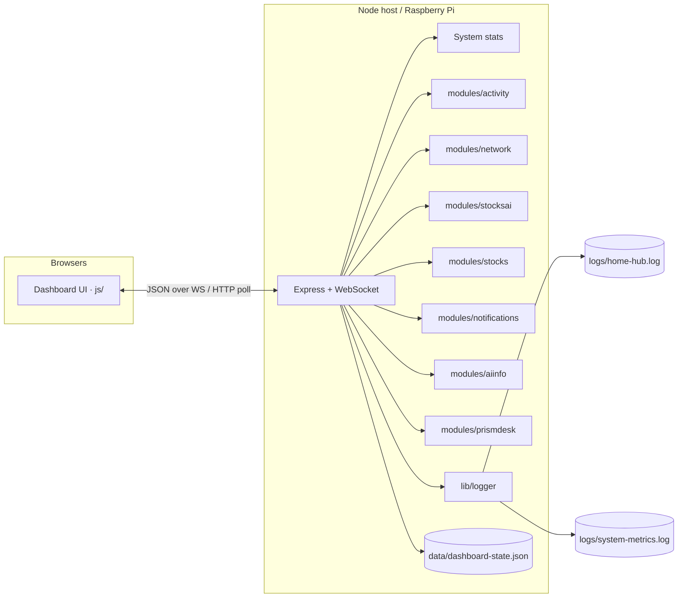

<div align="center">

# Home Hub

**Smart home dashboard for Raspberry Pi**

Sidebar modules for tools · Home for widgets · Live sync over WebSocket

[](https://nodejs.org/)
[](https://expressjs.com/)
[](https://github.com/websockets/ws)
[](./package.json)

</div>

---

## Overview

Home Hub is a modular dashboard for a Raspberry Pi (or any Node host). Use the **sidebar** for full tools and **Home** for glanceable widgets — Apple Watch–style complications with Fitness rings for System Monitor.

```text
┌─────────────┬──────────────────────────────────────┐
│  Home Hub   │  page title · clock · theme · sync   │
├─────────────┼──────────────────────────────────────┤
│  Home       │                                      │
│  Notify     │   widgets  /  module page content    │
│  Logs       │                                      │
│  Stocks AI  │                                      │
│  Stocks     │                                      │
│  Monitor    │                                      │
│  Network    │                                      │
│  AI Info    │                                      │
│  PrismDesk  │                                      │
│             │                                      │
│  + Add      │                                      │
│    Widget   │                                      │
└─────────────┴──────────────────────────────────────┘
```

| Area | Role |
|:-----|:-----|
| **Sidebar** | App modules (pages): Home · Notifications · Logs · Stocks AI · Stocks · Monitor · Network · AI Info · PrismDesk |
| **Home** | Widget grid: System Monitor, Speed Test, Stocks AI Digest, Stocks AI Watchlist, Stocks Watchlist, AI Model, AI Token Window |
| **Developer** | Update (watch mode) · Clear All widgets |

New server features go in `modules/<name>/` (`server.js` + `client.js`). Core UI lives under `js/`.

KAP / Ollama integration: see [`CONTRACT.md`](./CONTRACT.md) (aligned with [pi-llm](https://github.com/yigitcnsn/pi-llm)).

---

## Features

- **Home widgets** — Apple Watch–style complications (circular small / modular medium & large); add, edit, resize, drag to reorder (type + size only — no custom names)
- **System Monitor** — pinned Fitness rings (CPU · Mem · Disk) with temperature at the center; live stats every 5s
- **Activity Monitor** — sidebar page with large history charts + metrics table (deep view; Home keeps the compact rings)
- **Notifications** — global info / warn / error inbox + toasts (not a mirror of Logs); modules push via `ctx.notify`
- **Logs** — live server + client log stream with All / Info / Warn / Error filters and Clear info
- **Network Analyzer** — full diagnostics on the Network page
- **Speed Test widget** — download / upload + Run on Home only
- **Stocks AI** — Borsa İstanbul disclosures: editable watchlist, hourly scrape, daily digest, Ollama sentiment (sidebar + Home widget)
- **Stocks** — Yahoo Finance quotes (no API key): separate watchlist, BIST browse, simple charts; Home watchlist widget; ~60s poll
- **Paper desk** — BIST-only virtual portfolio under Stocks (orders, fills, mark-to-market); optional auto strategy from KAP / news sentiment
- **News RSS** — Investing.com headlines → Ollama classify → paper signals (toggle on Paper desk)
- **AI Info** — configured Ollama model, online status, context / token window; model picker; Home widgets
- **PrismDesk** — live annotated camera feed + telemetry debug console (ingest from the desk pipeline)
- **Light & dark theme**, fullscreen, multi-device sync over WebSocket (HTTP polling fallback if WS unavailable)
- **Persistent layout** — browser `localStorage` + server `data/dashboard-state.json` (survives Update / `--watch` restarts)
- **In-page dialogs** — no browser `alert`/`confirm`; widget create failures show which widget broke and offer Clear widgets
- **Client → server logging** — UI errors land in Logs / `logs/home-hub.log`
- **File logging** — `logs/home-hub.log` (events) + `logs/system-metrics.log` (CPU / temp / mem / disk / load every 5s)

### Network Analyzer

| Capability | Details |
|:-----------|:--------|
| Interfaces | IP, MAC, gateway, DNS |
| Latency | Gateway, `1.1.1.1`, `8.8.8.8` |
| DNS timing | Resolve time for a known host |
| Speed | Download + upload (Cloudflare) |
| Wi‑Fi | SSID / signal when available |
| LAN | Neighbors + active TCP connections |
| History | Trends + recent test log |

Snapshot refreshes about every **20s**. Full test runs **hourly**, or on demand with **Run full test**.

> Home **Speed Test** widget = download / upload + **Run** only  
> (`Add Widget` → Speed Test)

### Stocks AI module

On the Pi:

```bash
cp .env.example .env   # set KAP_WATCHLIST, Ollama, etc.
export OLLAMA_BASE_URL=http://127.0.0.1:11434
export OLLAMA_MODEL=qwen2.5:3b
export KAP_WATCHLIST=THYAO,ASELS
export KAP_LANGUAGE=tr
cd ~/home-hub && npm start
```

Sidebar **Stocks AI**: editable watchlist, daily digest, latest disclosures, scrape (watchlist / general), paste→classify, sentiment badges. Home widgets: **Stocks AI Digest** (today’s counts) and **Stocks AI Watchlist** (add/remove tickers). Watchlist persists under `data/stocksai/watchlist.json` (seeded from `KAP_WATCHLIST`). Auto-scrape runs once per hour.

### Stocks module

Yahoo Finance quotes (no API key). Watchlist is **separate** from KAP (`data/stocks/watchlist.json`, seeded from `STOCKS_WATCHLIST`). Sidebar **Stocks**: watchlist prices, BIST browse/search, detail chart. Home widget: **Stocks Watchlist**. Quotes refresh about every **60s**.

```bash
export STOCKS_WATCHLIST=THYAO,ASELS
# optional: STOCKS_POLL_INTERVAL_MS=60000
```

> Not investment advice. Data is delayed / unofficial Yahoo endpoints.

### Paper desk & news

Virtual BIST portfolio under the **Stocks** page (cash, orders, fills, soft limit friction). Optional auto strategy (`PAPER_AUTO_TRADE`) turns KAP / news sentiment into paper buys/sells with take-profit / stop-loss / hold timeout. Investing.com RSS headlines can be toggled from the Paper desk UI (state under `data/stocks/`). See `.env.example` for `PAPER_*` and `NEWS_RSS_*` knobs.

### Notifications

Global alerts with levels **info**, **warn**, and **error**. Sidebar inbox + corner toasts. Separate from **Logs** (does not subscribe to the logger). Other modules call `ctx.notify({ level, title, body, source })`. Runtime store: `data/notifications/`.

### AI Info

Sidebar **AI Info** shows the active Ollama model, online status, parameter size, and reported context / token window (`/api/show`). Use the model picker to switch among installed tags without restart (persisted in `data/aiinfo/`). Home widgets: **AI Model**, **AI Token Window**.

### PrismDesk

Sidebar **PrismDesk** is a debug console for the spatial AR desk pipeline (sibling [PrismDesk](https://github.com/yigitcnsn/PrismDesk) project). The desk can publish annotated JPEG frames and telemetry; Home Hub keeps only the newest frame in memory and shows live status chips (mat lock, hands, FPS, object). Overlay toggles on the page are polled by the desk via `GET /api/prismdesk/config`.

This hub module does **not** run camera / measure / projector logic — it only ingests and displays what the desk posts.

---

## Quick start

```bash
git clone https://github.com/yigitcnsn/home-hub.git
cd home-hub
npm install
./start.sh
```

Or with auto-update on the Pi (no local edits on the device):

```bash
cp .env.example .env   # edit KAP_WATCHLIST, etc.
./start.sh --watch        # foreground supervisor
# or
./start.sh --watch --bg   # background (logs/watch.out)
```

Every ~60s (`HOMEHUB_WATCH_SECONDS`) it `git fetch`es; if `origin` is ahead it `git pull --ff-only`, restarts Node, and open browsers reload when `/api/version` changes.

Sidebar **Developer → Update** requests an immediate check (does not wait for the timer). Requires `--watch`.

Open **[http://localhost:3000](http://localhost:3000)**  
On your LAN: `http://<host-ip>:3000` or `http://ev.local`

### Raspberry Pi deploy

```bash
# on your machine
git push

# on the Pi
git pull
npm start   # or ./start.sh --watch
```

Then hard-refresh the browser (or let auto-reload do it under `--watch`).

> Static UI updates on refresh. **Server / module changes need a Node restart** (or `--watch`).

---

## Architecture


```mermaid
flowchart LR
  subgraph clients [Browsers]
    A[Dashboard UI · js/]
  end

  subgraph host [Node host / Raspberry Pi]
    B[Express + WebSocket]
    C[System stats]
    D[modules/activity]
    E[modules/network]
    F[modules/stocksai]
    F2[modules/stocks]
    F3[modules/notifications]
    F4[modules/aiinfo]
    F5[modules/prismdesk]
    G[lib/logger]
    H[(data/dashboard-state.json)]
  end

  A <-->|JSON over WS / HTTP poll| B
  B --> C
  B --> D
  B --> E
  B --> F
  B --> F2
  B --> F3
  B --> F4
  B --> F5
  B --> G
  B --> H
  G --> I[(logs/home-hub.log)]
  G --> J[(logs/system-metrics.log)]
```

| Layer | Responsibility |
|:------|:---------------|
| **`js/`** | Client mixins: widgets, sync, dialogs, storage, logging |
| **`modules/`** | Pluggable page + widget features (server + client) |
| **`server.js`** | Express, WebSocket `/dashboard`, system stats, layout persistence |
| **`lib/`** | Logger + build id (`git` short SHA → `/api/version`) |

---

## Widget types

| Type | Notes |
|:-----|:------|
| **System Monitor** | Persistent — Fitness rings; always on Home |
| **Speed Test** | Compact down / up + Run |
| **Stocks AI Digest** | Today’s filing count + good / bad / other |
| **Stocks AI Watchlist** | Tickers with sentiment; add / remove |
| **Stocks Watchlist** | Yahoo prices + change %; add / remove |
| **AI Model** | Active Ollama model + online status |
| **AI Token Window** | Reported context / max tokens for the model |

**Sizes:** Small `1×1` (circular) · Medium `2×1` · Large `2×2`  
System Monitor always spans the full row.

---

## Project layout

```text
home-hub/
├── index.html                 # Shell, panels, Add Widget + app dialogs
├── styles.css                 # Theme + complication styles
├── script.js                  # Boots ModuleManager only
├── server.js                  # Express + WebSocket + system stats
├── start.sh                   # Launch / --bg / --watch supervisor
├── .env.example               # KAP + Stocks + Ollama + watch interval
├── CONTRACT.md                # KAP ↔ Ollama / pi-llm
├── js/                        # Client core (mixins)
│   ├── module-manager.js      # CRUD, nav, DnD, theme, clock
│   ├── widgets.js             # Complication render + Fitness rings
│   ├── system-monitor.js      # Live stats → Home widget
│   ├── storage.js             # localStorage + Clear All
│   ├── sync.js                # WebSocket sync + HTTP polling fallback + auto-reload
│   ├── dialog.js              # In-page dialogs / failsafe
│   ├── logging.js             # Client → server logs
│   └── utils.js
├── lib/
│   ├── logger.js              # File + memory logging
│   └── build-id.js
├── modules/
│   ├── index.js               # Server module registry
│   ├── notifications/         # Global info/warn/error alerts (not Logs)
│   ├── activity/              # Logs page (server activity stream)
│   ├── system/                # System Monitor widget registration
│   ├── network/               # Network page + Speed Test widget
│   ├── stocksai/              # KAP scrape / classify / store (Stocks AI)
│   ├── stocks/                # Yahoo quotes / watchlist / charts / paper / news
│   ├── aiinfo/                # Ollama model + token window page/widgets
│   └── prismdesk/             # Desk feed ingest + debug console
├── data/                      # Runtime (gitignored): dashboard-state, stocksai/, stocks/, notifications/, aiinfo/, flags
└── logs/                      # Runtime (gitignored): home-hub.log, system-metrics.log
```

---

## Environment

Copy `.env.example` → `.env` (loaded by `./start.sh`):

| Variable | Purpose |
|:---------|:--------|
| `OLLAMA_BASE_URL` | Ollama API (default `http://127.0.0.1:11434`) |
| `OLLAMA_MODEL` | Seed model name (default `qwen2.5:3b`); runtime picker on AI Info |
| `KAP_LANGUAGE` | Classify language (default `tr`) |
| `KAP_WATCHLIST` | Comma-separated tickers (e.g. `THYAO,ASELS`) |
| `KAP_PROMPT_PATH` | Sentiment prompt file |
| `KAP_POLL_INTERVAL_MS` | Scheduled scrape interval (default **1 hour** / `3600000`) |
| `STOCKS_WATCHLIST` | Seed tickers for Stocks module (e.g. `THYAO,ASELS`) — separate from KAP |
| `STOCKS_POLL_INTERVAL_MS` | Quote refresh interval (default **60s** / `60000`) |
| `PAPER_STARTING_CASH_TRY` | Paper desk starting cash (default `100000`) |
| `PAPER_AUTO_TRADE` | Enable KAP/news → paper strategy when `1` |
| `NEWS_RSS_ENABLED` | Seed default for Investing.com RSS (UI can override) |
| `AIINFO_POLL_MS` | AI Info refresh interval (default `30000`) |
| `HOMEHUB_WATCH_SECONDS` | Watch-mode fetch interval (default `60`) |
| `PORT` | HTTP port (default `3000`) |

---

## API & WebSocket

<details>
<summary><strong>HTTP</strong></summary>

| Method | Path | Description |
|:-------|:-----|:------------|
| `GET` | `/api/health` | Liveness: uptime, build, WS clients, logger writable, PrismDesk ingest summary |
| `GET` | `/api/version` | Build id, branch, startedAt |
| `POST` | `/api/update/now` | Request watch-mode pull now |
| `GET` | `/api/dashboard/state` | Persisted widget layout (HTTP sync) |
| `POST` | `/api/dashboard/state` | Push / merge widget layout |
| `POST` | `/api/dashboard/instance` | Push single instance update |
| `GET` | `/api/notifications` | Global notifications snapshot |
| `POST` | `/api/notifications` | Create notification `{ level, title, body, source }` |
| `POST` | `/api/notifications/read-all` | Mark all read |
| `POST` | `/api/notifications/clear` | Dismiss all |
| `GET` | `/api/logs` | Recent log entries |
| `POST` | `/api/logs/client` | Ingest client log |
| `POST` | `/api/logs/clear-info` | Remove info-level logs |
| `GET` | `/api/network` | Analyzer state + snapshot |
| `GET` | `/api/aiinfo` | Ollama model + token window |
| `POST` | `/api/aiinfo/refresh` | Refresh model metadata |
| `POST` | `/api/aiinfo/model` | `{ model }` select active Ollama model |
| `GET` | `/api/stocksai` | Stocks AI / KAP state |
| `GET` | `/api/stocksai/disclosures` | Watchlist + disclosures |
| `GET` | `/api/stocksai/jobs/:id` | Classify / scrape job status |
| `POST` | `/api/stocksai/watchlist` | `{ action: 'add'\|'remove'\|'set', code?, codes? }` |
| `POST` | `/api/stocksai/scrape` | `{ mode: 'watchlist' \| 'general' }` |
| `POST` | `/api/stocksai/classify` | Paste text or `disclosureId` |
| `GET` | `/api/stocks` | Stocks state (watchlist + quotes) |
| `POST` | `/api/stocks/watchlist` | `{ action: 'add'\|'remove'\|'set', code?, codes? }` |
| `GET` | `/api/stocks/quote` | `?symbols=THYAO,ASELS` |
| `GET` | `/api/stocks/search` | `?q=` BIST browse / direct symbol |
| `GET` | `/api/stocks/chart` | `?symbol=THYAO&range=1mo` OHLCV |
| `POST` | `/api/stocks/refresh` | Force watchlist quote refresh |
| `GET` | `/api/stocks/paper` | Paper desk portfolio / orders / fills |
| `POST` | `/api/stocks/paper/order` | Place paper order |
| `POST` | `/api/stocks/paper/cancel` | Cancel paper order |
| `POST` | `/api/stocks/paper/reset` | Reset paper portfolio |
| `POST` | `/api/stocks/paper/auto` | Toggle auto strategy |
| `POST` | `/api/stocks/news` | Toggle / status for Investing.com RSS |
| `POST` | `/api/prismdesk/frame` | Ingest annotated JPEG (or multipart `frame` + `state`) |
| `POST` | `/api/prismdesk/state` | Ingest JSON telemetry |
| `GET` | `/api/prismdesk/latest.jpg` | Newest annotated frame |
| `GET` | `/api/prismdesk/state` | Telemetry + frame metadata |
| `GET` | `/api/prismdesk/config` | Overlay toggles (desk polls) |
| `PUT` | `/api/prismdesk/config` | Update overlay toggles |
| `GET` | `/api/prismdesk/debug` | Ingest counters / last error (no image payload) |

</details>

<details>
<summary><strong>WebSocket</strong> — <code>ws://&lt;host&gt;:3000/dashboard</code></summary>

**Server → client**

| Type | Purpose |
|:-----|:--------|
| `build_info` | Build id (triggers browser reload) |
| `system_stats` | Pi metrics → System / Activity Monitor |
| `full_state` / `instance_update` | Widget layout & instance sync |
| `logs_snapshot` / `log_entry` | Log stream |
| `notifications_state` / `notification_entry` | Global notifications |
| `network_state` / `network_stats` / `network_snapshot` | Analyzer updates |
| `aiinfo_state` | Ollama model / token window |
| `stocksai_state` | Stocks AI / KAP updates |
| `stocks_state` | Stocks watchlist + quotes |
| `stocks_paper_state` | Paper desk portfolio |
| `ping` | Keep-alive |

**Client → server**

| Type | Purpose |
|:-----|:--------|
| `full_state_sync` / `instance_update` | Push layout / instance data |
| `client_log` | UI errors → Logs |
| `clear_info_logs` | Clear info logs |
| `notification_create` / `notification_dismiss` / `notification_read` | Notifications |
| `notifications_read_all` / `notifications_clear` | Notifications bulk |
| `pong` | Ping reply |
| `run_network_test` | Full network analysis |
| `refresh_network_snapshot` | Refresh interfaces / LAN / Wi‑Fi |
| `aiinfo_refresh` / `aiinfo_set_model` | AI Info refresh / model picker |
| `stocksai_scrape` / `stocksai_classify` | KAP jobs |
| `stocksai_watchlist_add` / `stocksai_watchlist_remove` | Edit watchlist |
| `stocks_watchlist_add` / `stocks_watchlist_remove` | Edit Stocks watchlist |
| `stocks_refresh` | Force Yahoo quote refresh |

</details>

---

## Adding a module

1. Create `modules/<name>/server.js` exporting `{ id, register(ctx) }`
2. Register it in `modules/index.js`
3. Add `modules/<name>/client.js` and set `window.HomeHubModules.<name>`
4. **Sidebar page:** `nav: true`, `view: '<id>'`, plus a panel in `index.html` with `data-view-panel="<id>"`
5. **Home widget:** `render`, `getSampleData`, and an option in the Add Widget dropdown
6. Keep core UI changes in `js/` (mixins on `ModuleManager.prototype`)

---

## Troubleshooting

| Issue | Fix |
|:------|:----|
| Port `3000` in use | Stop the old process, then `npm start` / `./start.sh` |
| Sync disconnected | Confirm the server is running; check firewall. Without WebSocket, UI falls back to HTTP polling (`Poll`) |
| Widgets empty after Update | Open Home once to re-seed; layout is in `data/dashboard-state.json` + browser storage |
| Widget create error dialog | Check **Logs** for the failing widget; use **Clear widgets** if the layout is corrupt |
| Network page stale | `git pull`, restart Node, hard-refresh |
| Speed Test stuck on *Testing…* | Restart server after pull so finish broadcasts are current |
| KAP classify fails | Confirm Ollama is up and `OLLAMA_*` / `KAP_*` env vars match [`CONTRACT.md`](./CONTRACT.md) |

---

## Requirements

- **Node.js** 18+
- Modern browser with CSS Grid, Flexbox, WebSocket, and `localStorage`
- Optional: **Ollama** on the Pi for KAP sentiment

---

<div align="center">

MIT · Built for the home lab

</div>
